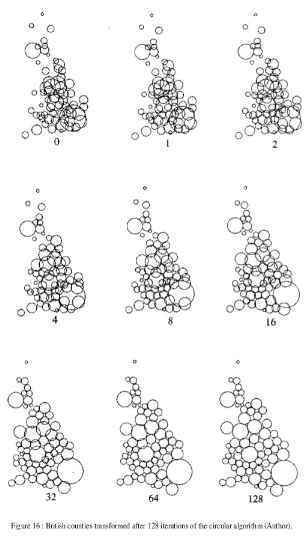
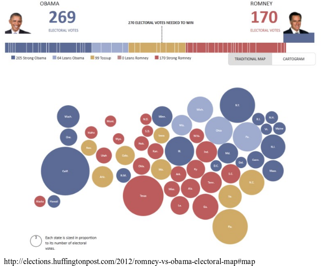
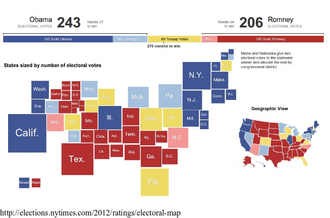
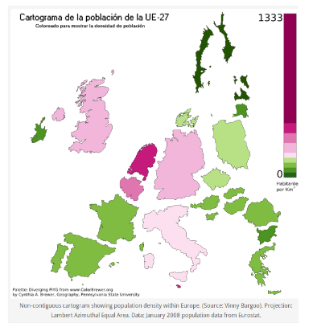
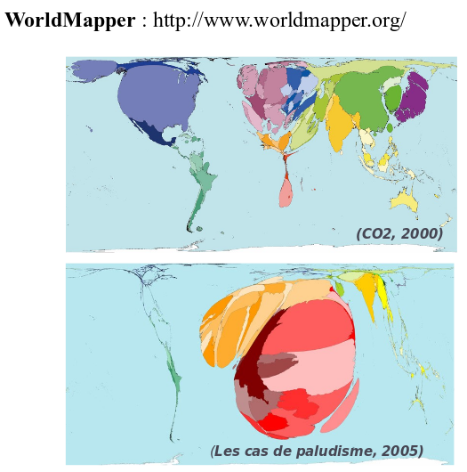

```{r setup, include=FALSE}
knitr::opts_chunk$set(echo = TRUE)
```


## Les anamorphoses

[Les anamorphoses cartographiques](https://neocarto.hypotheses.org/366) 
*Nicolas Lambert, 2015*


## Théorie

"L’anamorphose classique est une représentation des États (ou de mailles quelconques) par **des rectangles ou des polygones quelconques** en fonction d’une **quantité** qui leur est rattaché."  

"Certaines anamorphoses traduisent des différences entre un espace de référence et un espace représenté, ou construit, exprimant par exemple des **liens** entre des villes selon un moyen de transport donné."  

"On s’efforce de **garder l’arrangement général** des mailles ou la silhouette du continent."


*Brunet, R., Ferras, R., & Théry, H. (1993). Les mots de la géographie: dictionnaire critique (No. 03) 911 BRU).*

Il existe donc principalement deux types de cartogrammes : 

- les cartogrammes de surface
- les cartogrammes de distance

## Les cartogrammes de surface

- Les cartogrammes de dorling
- Les cartogrammes continus
- Les cartogrammes non continus


## Les cartogrammes de dorling

La taille des cercles est proportionnelle à une variable. 

La position des cercles est définie selon les positions de départ. 

*Dorling, Daniel (1996): Area Cartograms: Their Use and Creation, Concepts and Techniques in Modern Geography (CATMOG), 59*

## Le principe




## Exemple



## Exemple




## Précautions d'emploi

\- On identifie assez mal l'espace  
On peut nommer les cercles pour se repérer  
On peut s'aider de la couleur pour faire des clusters et mieux identifier les blocks géographiques  


\+ La perception de la quantité est très bonne.   
Les tailles de cercles sont vraiment comparables  


## Mise en oeuvre avec R

Le package `cartogram` permet de réaliser les cartogrammes de Dorling. 

```{r, cache=T}
library(sf)
library(cartogram)
library(cartography)
par(mar = c(0,0,0,0))
com46 <- readRDS(file = "com46.rds")
plot(st_geometry(com46))
plot(st_geometry(com46), col = "ivory2")
propSymbolsLayer(com46, var = "TOT", legend.pos = "topleft")
com46_dorling <- cartogram_dorling(x = com46, weight = "TOT", k = 10)
plot(st_geometry(com46_dorling), col = 'ivory2')
```


## Les cartogrammes non continus

La taille des polygones est proportionnelle à une variable.     

L'agencement des polygones les uns par rapport aux autres est conservée.   

La forme des polygones est ressemblante.   

## 




## Précautions d'emploi

\- Non contigu, la topologie est perdue.

\+ La conservation de la forme des polygones est optimisée.


## Mise en oeuvre avec R

```{r, cache=T}
library(sf)
library(cartogram)
library(cartography)
par(mar = c(0,0,0,0))
com46 <- readRDS(file = "com46.rds")
com46_ncont <- cartogram_ncont(x = com46, weight = "TOT", k = 1.5)
plot(st_geometry(com46_ncont), col = 'ivory2')
```

## Autres logiciels

Cette représentation est possible avec Magrit.   
Representation > Cartogram > méthode Olson 2005


## Les cartogrammes continus


La taille des polygones est proportionnelle à une variable.  

L'agencement des polygones les uns par rapport aux autres est conservée.  

Pour conserver la contiguité, la forme des polygones est fortement transformée.  

## 



## Précautions d'emploi

\- Par rapport aux anamorphoses non contigues, la forme des polygones est fortement distordue.

\+ C'est une “vraie carte de géographie” : la topologie et la contiguité sont conservées.


## Mise en oeuvre avec R

```{r, cache=T}
library(sf)
library(cartogram)
library(cartography)
par(mar = c(0,0,0,0))
com46 <- readRDS(file = "com46.rds")
com46_cont <- cartogram_cont(x = com46, weight = "TOT", itermax = 5)
plot(st_geometry(com46_cont), col = 'ivory2')
```


## Autres logiciels

Cette représentation est possible avec Magrit.   
Representation > Cartogram > méthode Dougenik & al. 1985  

Le logiciel [ScapeToad](https://scapetoad.choros.ch/) est dédié à la construction de telles anamorphoses.

Il existe surement des extensions QGIS ou ArcGis...


## les cartogrammes de distance


##

### Interêts des anamorphoses

Représentation cartographique perçue comme **innovante** (même si la methode date de 40 ans)

Image très généralisée qui rend bien compte des **quantités** et des **gradiants**. 

Une vraie image de **communication** : **provoque**, suscite **l’intérêt**, véhicule un **message** fort, **interpelle**.


### Faiblesses des anamorphoses

Perte des **repères visuels** (difficile de retrouver son pays, ou sa région sur la carte).

Ne permet pas de connaître les **situations locales**.

Demande un **effort de lecture**.

**Gestion des données manquantes**


## Les grilles régulières

## Les discontinuités 

## Les lissages
  - potentiels

##
Conception cartographique, TP 4
Les transformations cartographiques

Calendrier : rendu le mercredi 5 décembre 2018 (impression)
Thème proposé : 
Population et revenus des communautés d’agglomération d’Île de France


Objectifs et contraintes :

Réalisation d’une planche cartographique technique sur les modes de représentation cartographique issus de  transformations visuelles (anamorphose, lissage, carroyage et/ou discontinuités). 

 
Objectifs pédagogiques : 
Travail des modes de représentation cartographique originaux
Travail des visuels complexes
Lien entre les différentes méthodes de représentation
Travail des légendes adaptées 
Savoir expliquer ce que l’on sait faire. 

Contraintes pédagogiques : 
Carte en couleurs
La planche doit présenter au moins deux modes de représentation 
Les cartes illustratives présentent une thématique originale issue des données sur les communautés d’agglomérations en Île de France. 

Contraintes techniques : 
format = planche cartographique A3
support = papier brillant pour affichage poster scientifique
public = colloque du CIST sur la représentation des territoires d’Iles de France (http://www.gis-cist.fr/) 
Vous pouvez consulter le site du CIST pour s’inspirer (style, logo, niveau scientifique etc…)


Documents de travail :
Données des précédents TP
PPT de cours sur les transformations cartographiques 


