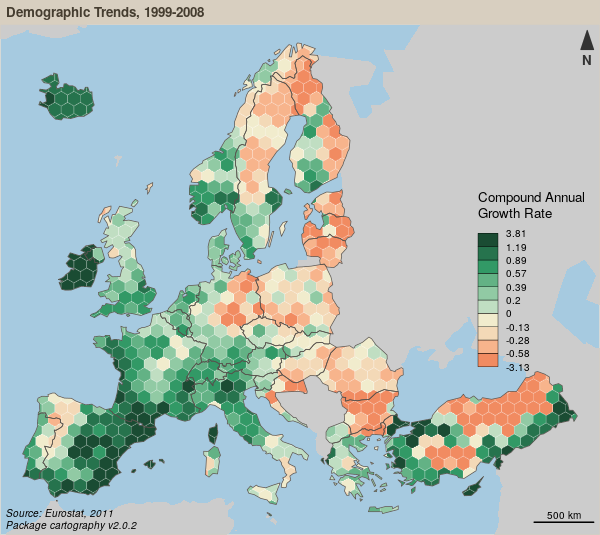
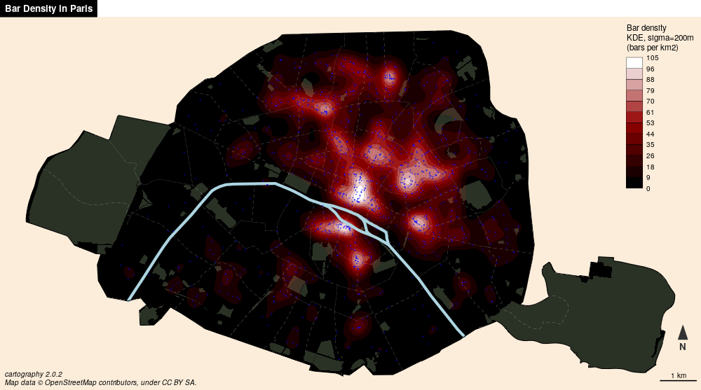

```{r setup, include=FALSE}
knitr::opts_chunk$set(echo = TRUE)
```


## Les anamorphoses

[Les anamorphoses cartographiques](https://neocarto.hypotheses.org/366)   
*Nicolas Lambert, 2015*


## Théorie

"L’anamorphose classique est une représentation des États (ou de mailles quelconques) par **des rectangles ou des polygones quelconques** en fonction d’une **quantité** qui leur est rattaché."  

"Certaines anamorphoses traduisent des différences entre un espace de référence et un espace représenté, ou construit, exprimant par exemple des **liens** entre des villes selon un moyen de transport donné."  

"On s’efforce de **garder l’arrangement général** des mailles ou la silhouette du continent."


*Brunet, R., Ferras, R., & Théry, H. (1993). Les mots de la géographie: dictionnaire critique (No. 03) 911 BRU).*


</br></br>

Il existe donc principalement deux types de cartogrammes : 

- les cartogrammes de surface
- les cartogrammes de distance

## Les cartogrammes de surface

- Les cartogrammes de Dorling
- Les cartogrammes continus
- Les cartogrammes non continus


## Les cartogrammes de Dorling

La taille des cercles est proportionnelle à une variable. 

La position des cercles est définie selon les positions de départ. 

*Dorling, Daniel (1996): Area Cartograms: Their Use and Creation, Concepts and Techniques in Modern Geography (CATMOG), 59*

## Le principe


## Exemple


## Exemple


## Précautions d'emploi

\- On identifie assez mal l'espace  
On peut nommer les cercles pour se repérer  
On peut s'aider de la couleur pour faire des clusters et mieux identifier les blocks géographiques  


\+ La perception de la quantité est très bonne.   
Les tailles de cercles sont vraiment comparables  


## Mise en oeuvre avec R

Le package `cartogram` permet de réaliser les cartogrammes de Dorling. 

```{r, cache=T, message=FALSE, warning=FALSE}
library(sf)
library(cartogram)
library(cartography)
par(mar = c(0,0,0,0))
com46 <- readRDS(file = "com46.rds")
plot(st_geometry(com46))
plot(st_geometry(com46), col = "ivory2")
propSymbolsLayer(com46, var = "TOT", legend.pos = "topleft")
com46_dorling <- cartogram_dorling(x = com46, weight = "TOT", k = 10)
plot(st_geometry(com46_dorling), col = 'ivory2')
```


## Les cartogrammes non continus

La taille des polygones est proportionnelle à une variable.     

L'agencement des polygones les uns par rapport aux autres est conservée.   

La forme des polygones est ressemblante.   

## Exemple


## Précautions d'emploi

\- Non contigu, la topologie est perdue.

\+ La conservation de la forme des polygones est optimisée.


## Mise en oeuvre avec R

```{r, cache=T}
library(sf)
library(cartogram)
library(cartography)
par(mar = c(0,0,0,0))
com46 <- readRDS(file = "com46.rds")
com46_ncont <- cartogram_ncont(x = com46, weight = "TOT", k = 1.5)
plot(st_geometry(com46_ncont), col = 'ivory2')
```

## Autres logiciels

Cette représentation est possible avec Magrit.   
Representation > Cartogram > méthode Olson 2005


## Les cartogrammes continus


La taille des polygones est proportionnelle à une variable.  

L'agencement des polygones les uns par rapport aux autres est conservée.  

Pour conserver la contiguité, la forme des polygones est fortement transformée.  

## Exemple


## Précautions d'emploi

\- Par rapport aux anamorphoses non contigues, la forme des polygones est fortement distordue.

\+ C'est une “vraie carte de géographie” : la topologie et la contiguité sont conservées.


## Mise en oeuvre avec R

```{r, cache=T, message=F, warning=F}
library(sf)
library(cartogram)
library(cartography)
par(mar = c(0,0,0,0))
com46 <- readRDS(file = "com46.rds")
com46_cont <- cartogram_cont(x = com46, weight = "TOT", itermax = 5)
plot(st_geometry(com46_cont), col = 'ivory2')
```


## Autres logiciels

Cette représentation est possible avec Magrit.   
Representation > Cartogram > méthode Dougenik & al. 1985  

Le logiciel [ScapeToad](https://scapetoad.choros.ch/) est dédié à la construction de telles anamorphoses.

Il existe surement des extensions QGIS ou ArcGis...


## Les cartogrammes de distance

Il s'agit de déformer la carte en fonction de distances non topologiques. 

## Exemple


## Exemple


## Précautions d'emploi

\- Experimental, difficile à réaliser.  
Les résultats doivent être interprétés soigneusement en fonction du sujet concerné, des hypothèses émises et des données entrées. 

\+ Très original.  
Cartes assez “expressives”


## Mise en oeuvre avec R et QGIS

* Le package `osrm` permet de créer une matrice de distance routières basée sur le réseau OSM.   
* Le plugin QGIS DistanceCartogram permet de réaliser facilement ces anamorphoses. 


## Autres logiciels
Le logiciel [darcy](http://thema.univ-fcomte.fr/production/logiciels/16-categories-en-francais/cat-productions-fr/cat-logiciels-fr/294-art-darcy) permet de réaliser ces anamorphoses. 


## Bilan

### Interêts des anamorphoses

Représentation cartographique perçue comme **innovante** (même si la methode date de 40 ans)

Image très généralisée qui rend bien compte des **quantités** et des **gradiants**. 

Une vraie image de **communication** : **provoque**, suscite **l’intérêt**, véhicule un **message** fort, **interpelle**.


### Faiblesses des anamorphoses

Perte des **repères visuels** (difficile de retrouver son pays, ou sa région sur la carte).

Ne permet pas de connaître les **situations locales**.

Demande un **effort de lecture**.

**Gestion des données manquantes**


## Les grilles régulières

Par une série d'opération SIG assez simple il est possible de transformer des données d'un maillage initial vers un maillage régulier plus neutre et plus simple. 


## Exemple


## Exemple



## Précautions d'emploi

\- Perte de précision, maillage sans signification. La version simple (au prorata de la surface), implique une equirépartition du phénomène dans chaque unités. 


\+ Permet la comparaison de maillages différents, à plusieurs dates ou de différentes sources. 

## Mise en oeuvre dans R
```{r, cache=T, message=F, warning=F}
library(sf)
library(cartogram)
library(cartography)
par(mar = c(0,0,0,0))
com46 <- readRDS(file = "com46.rds")
bks <- getBreaks(v = com46$PAGR, method = "q6", nclass = 8)[-1]
cols <- carto.pal("green.pal", 2, "wine.pal", 3)
choroLayer(x = com46, var = "PAGR", breaks = bks, col = cols, lwd = .5, 
           legend.pos = "topleft")
com46_grid <- getGridLayer(x = com46, cellsize = 5000 * 5000, 
                           type = "hexagonal", var = c("AGR", "TOT"))
com46_grid$PAGR <- 100 * com46_grid$AGR / com46_grid$TOT
choroLayer(x = com46_grid, var = "PAGR", breaks = bks, col = cols,
           lwd = .5, legend.pos = "topleft")

```


## Autres logiciels

Les SIG!


## Les discontinuités 

Ce type de représentation permet de souligner cartographiquement les discontinuités territoriales d'un phénomène. 

L'accent est porter sur ce qui distingue des territoires. 

Pour chaque frontière nous calculons le rapports ou la différence des valeurs des polygones de part et d'autre. Puis nous représentons la frontière par un figuré d'autant plus épais que la différence est forte. 

Il est souvent bénéfique de coupler ce type de représentation à une représentation choroplèthe (pour comprendre le sens des discontinuités).


## Exemple


## Exemple


## Précautions d'emploi

\- Ces cartes ne sont pas évidentes à paramétrer. Le choix des critères (seuil, type de différences...) va fortement influencer la représentation. En fonction du maillage la lisibilité peut être faible. 


\+ Représentation très puissante pour représenter les inégalités. 


## Mise en oeuvre dans R
```{r, cache=T, message=F, warning=F}
library(sf)
library(cartography)
par(mar = c(0,0,0,0))
com46 <- readRDS(file = "com46.rds")
com46_border <- getBorders(x = com46, id = "INSEE_COM")
plot(st_geometry(com46), border = NA, col = "grey60")
# Plot borders
plot(st_geometry(com46_border), 
     col = sample(x = rainbow(nrow(com46_border))), 
     lwd = 3, add = TRUE)

bks <- c(0, 5, 10, 20, 40, 67)
cols <- carto.pal("wine.pal", 5)
choroLayer(x = com46, var = "PCAD", breaks = bks, col = cols, lwd = .5, 
           legend.pos = "topleft", border = NA)
discLayer(x = com46_border, df = com46,
          var = "PCAD", col="darkblue", nclass=3,
          method="quantile", threshold = 0.33, sizemin = 0.5,
          sizemax = 7, type = "abs", 
          legend.title.txt = "Discontinuities",
          legend.pos = "bottomright", add=TRUE)

```


## Autres logiciels

Magrit permet ce type de représentation. 

On peut utiliser un SIG en réalisant une longue suite d'opérations.


## Le lissage spatial

Le principe du lissage spatial est de filtrer l’information pour révéler des structures spatiales sous-jacentes. 

Il s'agit de considérer les observations statistiques en prenant en compte leur voisinnage. 

Ces méthodes permettent de passer de représentations discontinues (ponctuelles ou dans des mailles) vers des représentations continues.

Plusieurs méthodes existent comme les KDE ou les potentiels. 

## Exemple


## Exemple




## Lissage par la méthode des potentiels
[Vignette du package `SpatialPosition`](https://cran.r-project.org/web/packages/SpatialPosition/vignettes/StewartExample.html)


## Précautions d'emploi

\- Ces cartes ne sont pas évidentes à paramétrer. Le choix des paramètres doit dépendre des hypothèses que nous avons sur les interactions spatiales. Les méthodes statistiques mises en oeuvre ne sont pas accéssibles à tous les publics. 
Il est souvent nécessaire d'en simplifier la présentation (par des légendes qualitatives par exemple).

\+ Les cartes produites sont assez originales et attirent l'oeil. Elles permettent de s'affranchir du maillage initial. 


## Mise en oeuvre dans R
```{r, cache=T, message=F, warning=F}
library(sf)
library(cartography)
library(SpatialPosition)
par(mar = c(0,0,0,0))
com46 <- readRDS(file = "com46.rds")
com46_border <- getBorders(x = com46, id = "INSEE_COM")
plot(st_geometry(com46), border = NA, col = "grey60")
# Plot borders
plot(st_geometry(com46_border), 
     col = sample(x = rainbow(nrow(com46_border))), 
     lwd = 3, add = TRUE)

bks <- c(0, 5, 10, 20, 40, 67)
cols <- carto.pal("wine.pal", 5)
choroLayer(x = com46, var = "PCAD", breaks = bks, col = cols, lwd = .5, 
           legend.pos = "topleft", border = NA)
discLayer(x = com46_border, df = com46,
          var = "PCAD", col="darkblue", nclass=3,
          method="quantile", threshold = 0.33, sizemin = 0.5,
          sizemax = 7, type = "abs", 
          legend.title.txt = "Discontinuities",
          legend.pos = "bottomright", add=TRUE)

```


## Autres logiciels

La méthode de lissage par potentiels est disponible dans Magrit.   

Les SIG donnent accès à d'autre méthodes comme les KDE. 


